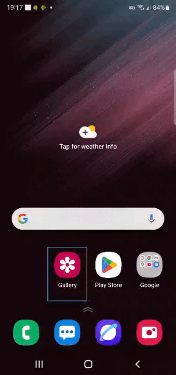

**Стек используемых технологий**  
<p align="center">


</p>

**Запустить Appium Server**  
```bash
appium server --base-path /wd/hub
```  
**Запустить эмулятор**  
```bash
emulator -avd Pixel_4 -gpu swiftshader_indirect
```  
**Проверить запущенные устройства**  
```bash
adb devices
```  
**Для запуска на разных стендах передать из командной строки:**  
```bash
./gradlew clean test -DdeviceHost=browserstack
./gradlew clean test -DdeviceHost=emulator
./gradlew clean test -DdeviceHost=real
```
**Real device**  
- Настройки > О телефоне > Версия ОС (Build number) > тап 7 раз
- Настройки > Расширенные настройки > Для разработчиков (Developer options)

Отключить:
* Отладка по USB
* Установка через USB
* Отладка по USB (настройки безопасности)
* Проверять байт-код приложений, доступный для отладки  

Выключить:
* Отключить автоматический отзыв авторизации adb
* Проверять приложение при установке

<a id="movie"></a>
 **Видео выполнения теста c Browserstack**
<p align="center">
   
</p>


