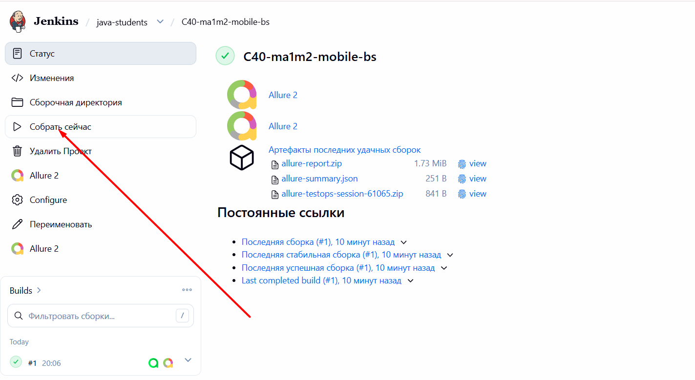
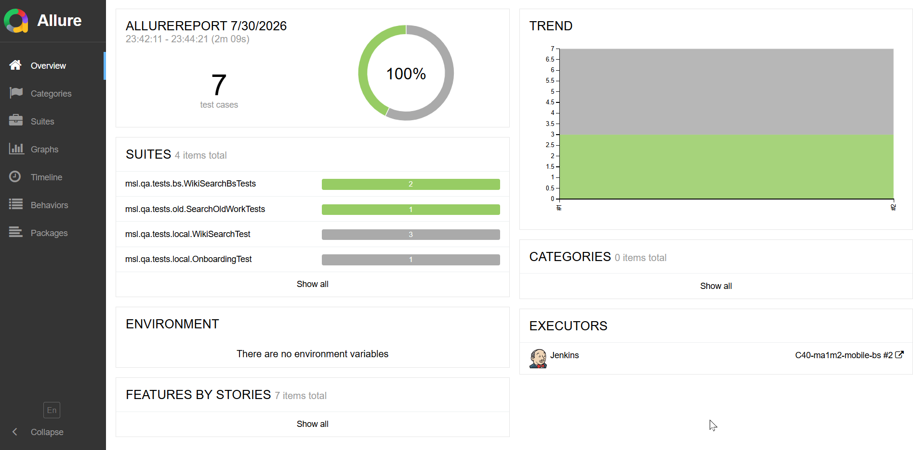
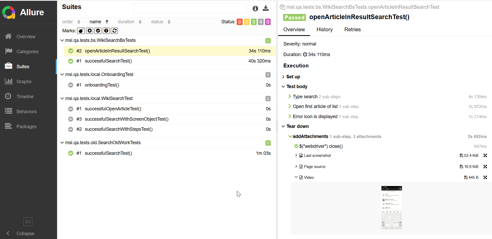
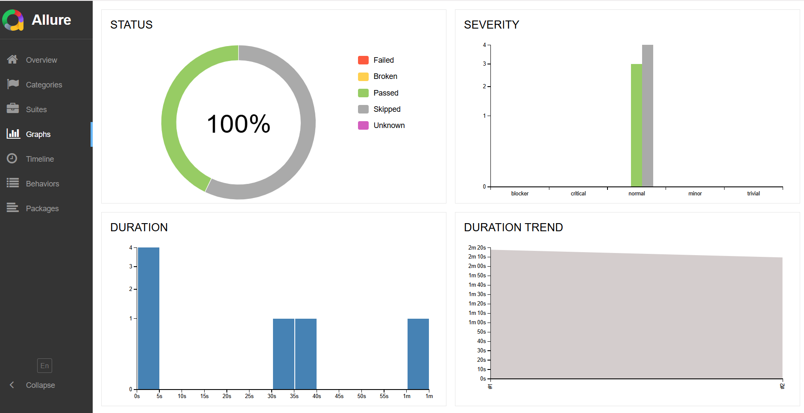
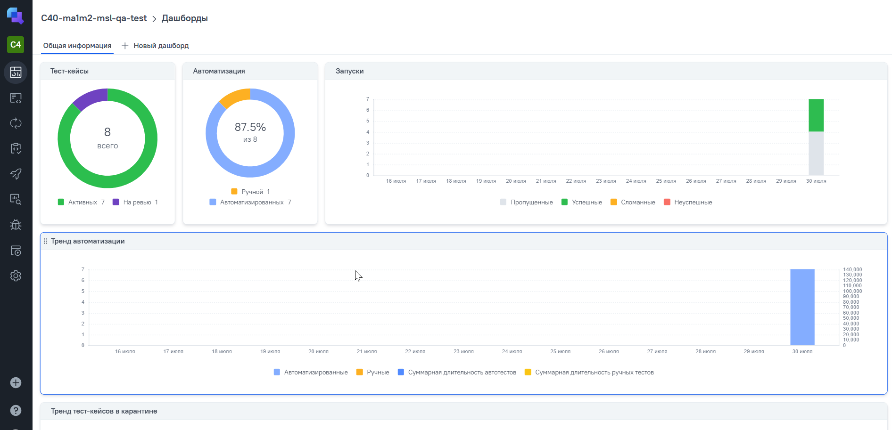
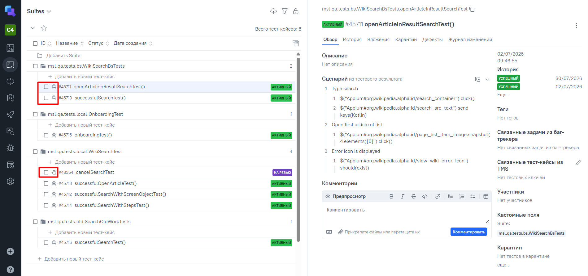
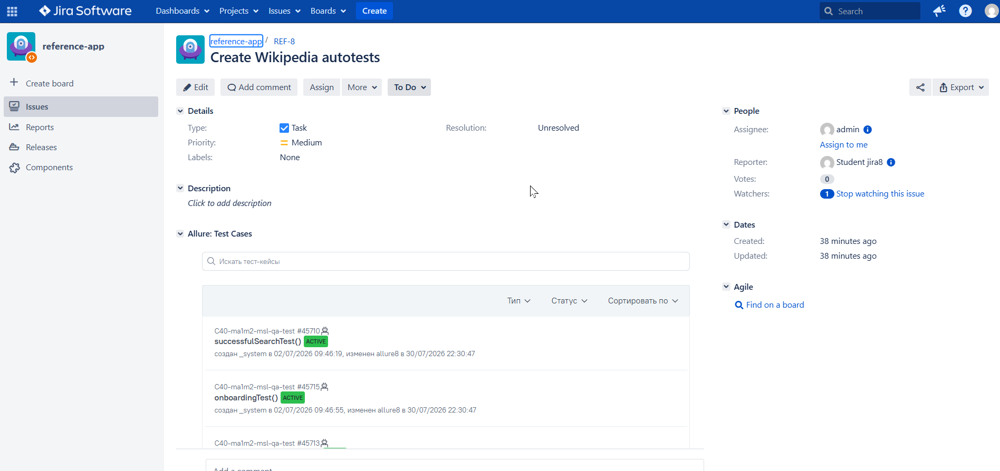
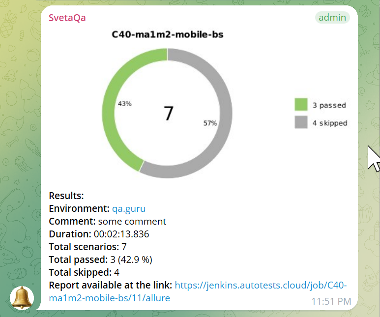
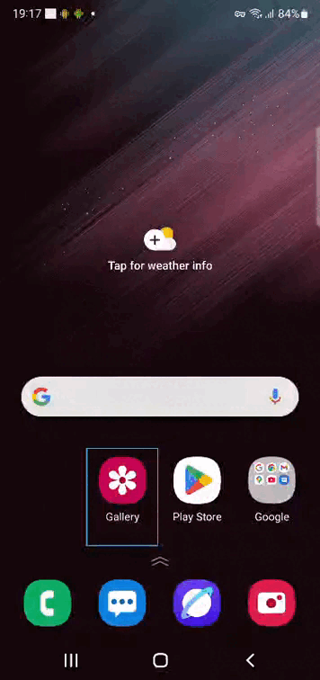
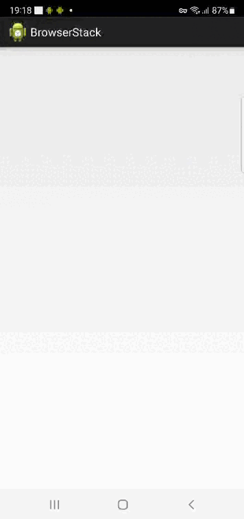

# Demo Project for automating mobile tests for the [Wikipedia](https://ru.wikipedia.org/)  application  

<p align="center">
<a href="https://ru.wikipedia.org/"></a>
</p>

> Wikipedia is a free, multilingual, general-interest online encyclopedia that operates on wiki principles.

## Contents:
____
* <a href="#tools">Technologies & Tools</a>

* <a href="#cases">Automated Test Scenarios</a>

* <a href="#setup">Environment Setup</a>

* <a href="#jenkins">Jenkins Build</a>

* <a href="#console">Running Tests (Terminal)</a>

* <a href="#allure">Allure Report</a>

* <a href="#allure-testops">Allure TestOps Integration</a>

* <a href="#jira">Jira Integration</a>

* <a href="#tg">Telegram Alerts</a>

* <a href="#video">BrowserStack Video Examples</a>
____
<a id="tools"></a>
## Technologies & Tools

<p align="center">  
<a href="https://www.jetbrains.com/idea/"></a>  
<a href="https://www.java.com/"></a>  
<a href="https://github.com/"></a>  
<a href="https://junit.org/junit5/"></a>  
<a href="https://gradle.org/"></a>
<a href="https://www.selenium.dev/"></a>  
<a href="https://selenide.org/"></a>  
<a href="https://aerokube.com/selenoid/"></a> 
<a href="https://appium.io/docs/en/latest/"></a>  
<a href="https://developer.android.com/studio?hl=ru"></a>
<a href="https://github.com/allure-framework/allure2"></a> 
<a href="https://qameta.io/"></a>
<a href="https://www.jenkins.io/"></a>  
<a href="https://www.atlassian.com/ru/software/jira/"></a>  
</p>


- Programming language: [Java](https://www.java.com/ru/)
- UI automation: [Selenide](https://selenide.org/)
- Test framework: [JUnit5](https://github.com/junit-team/junit5)
- Build system: [Gradle](https://gradle.org/)
- CI/CD: [Jenkins](https://www.jenkins.io/)
- Reporting: [Allure](https://github.com/allure-framework)
- Test run notifications: Telegram-bot
- Integration with  [Allure TestOps](https://qameta.io/)
- Integration with  [Jira Software](https://www.atlassian.com/software/jira)
___

<a id="#cases"></a>
## Automated Test Scenarios
### For local launch  

- Check Onboarding Screens
- Check successful Search Result
- Open first Search Result and check the article

### For remote launch
- Check successful Search Result
- Open article in Search Result and check Error icon.

____
<a id="setup"></a>
## Environment Setup  

**Start Appium Server**
```bash
appium server --base-path /wd/hub
```  
**Start the emulator**
```bash
emulator -avd Pixel_4 -gpu swiftshader_indirect
```  
**Check running devices**
```bash
adb devices
```

**Real Device Setup**  
Before running tests on a real Android device, configure it as follows: 
1. Enable Developer Options:
    - Go to **Settings** > **About phone** > tap **Build number** 7 times
    - Go back to **Settings** > **Advanced settings** > **Developer options**

2. Enable the following:
    - ✅ USB debugging
    - ✅ Install via USB
    - ✅ USB debugging (security settings)
    - ✅ Verify bytecode for debuggable apps

3. Disable the following:
    - ❌ Disable automatic ADB authorization revocation
    - ❌ Verify apps over USB

----
<a id="jenkins"></a>
##  </a> Jenkins Build <a target="_blank" href="https://jenkins.qa.guru/job/C40-ma1m2-redsoft/"></a>
To access Jenkins, registration on the resource is required [Jenkins](https://jenkins.qa.guru/). 
To start the build, click the <code>Build Now</code> button.
____
<p align="center">  
<a href="https://jenkins.qa.guru/view/java-students/job/C40-ma1m2-mobile-bs/" target="_blank" rel="noopener noreferrer"></a>  
</p>


<a id="console"></a>
## Running Tests (Terminal)

**To run on different environments, pass from the command line:**
```bash
./gradlew clean test -DdeviceHost=browserstack
./gradlew clean test -DdeviceHost=emulator
./gradlew clean test -DdeviceHost=real
```  
**To run a single specific test**
```bash
./gradlew clean test -DdeviceHost=emulator --tests "msl.qa.tests.local.WikiSearchTest.successfulSearchWithScreenObjectTest"
```   
**or (if the test name is unique)**
```bash
./gradlew clean test -DdeviceHost=emulator --tests "*.successfulSearchWithScreenObjectTest"
```  
**For smoke tests**  
`./gradlew clean smokeTest -DdeviceHost=emulator`

___
<a id="allure"></a>
## </a> <a name="Allure"></a>Allure [Report](https://jenkins.qa.guru/view/java-students/job/C40-ma1m2-mobile-bs/allure-report)</a>
___

### Overview page of Allure Report

<p align="center">  
  
</p>  

### Test-cases

<p align="center">  
  
</p>

### Graphs

  <p align="center">  

</p>

___
<a id="allure-testops"></a>
## </a> Integration with <a target="_blank" href="https://allure.autotests.cloud/project/5259/dashboards">Allure TestOps</a>
____
### *Allure TestOps Dashboard*

<p align="center">  
  
</p>  

### Auto and Manual Test-cases

<p align="center">  
  
</p>

___
<a id="jira"></a>
## </a> Integration with <a target="_blank" href="https://jira.qa.guru/browse/REF-8">Jira</a>
____
<p align="center">  
  
</p>

____
<a id="tg"></a>

## Telegram notifications:  

After the build is completed, a <code>Telegram bot</code> automatically processes the test run results and sends a report to a dedicated chat


____  
<p align="center">  
  
</p>


<a id="movie"></a>
 **BrowserStack Video Examples**  
<table align="center">
  <tr>
    <td align="center"></td>
    <td width="40"></td>
    <td align="center"></td>
  </tr>
</table>

